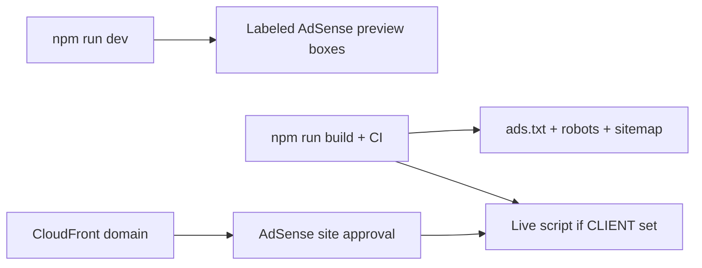

# AdSense — Stocks Radar

Publisher ads on the watchlist site for **passive income**. Friends use the radar; AdSense fills inventory after Google approves your domain.

> **AdSense ≠ Google Ads.** AdSense shows ads *on* your site. You do **not** OAuth your AdSense account into this app — you paste a publisher ID + ad unit IDs from the [AdSense console](https://www.google.com/adsense/).

## How it works here

| Mode | When | What you see |
|------|------|----------------|
| **Preview** | `npm run dev` (always) | Labeled dashed placeholders for hero / board / footer |
| **Live** | Production build with `PUBLIC_ADSENSE_CLIENT` + slot IDs | Real AdSense units |
| **Off** | `PUBLIC_ADSENSE_ENABLED=false` or empty client in prod | No slots |

Google almost never fills ads on `localhost`. Preview mode is intentional for layout QA.



## One-time: AdSense account + site

1. Create / open [Google AdSense](https://www.google.com/adsense/) with your Google account.
2. Add your **CloudFront URL** (or custom domain) as a site. Complete site verification (meta tag or `ads.txt` — we publish `ads.txt` at build time).
3. Wait for approval (can take days). Until then, slots stay empty in production even with IDs set.
4. **Ads → By ad unit → Display ads** — create 3 units (responsive), e.g. Radar hero / board / footer.
5. Copy **Publisher ID** (`ca-pub-…`) and each **Ad unit ID** (numbers).

## Local setup (see placeholders)

```bash
cd stocks/radar
cp .env.example .env
# Optional: paste CLIENT + slots now (still shows preview in npm run dev)
npm run dev
```

Open http://localhost:4321 — three **AdSense preview** boxes.

Force preview boxes on a production-style build:

```bash
# .env
PUBLIC_ADSENSE_PREVIEW=true
npm run rebuild
```

## Production (GitHub Actions)

Add **repository variables** (Settings → Secrets and variables → Actions → Variables) — not secrets, these are public in the page source:

| Variable | Example |
|----------|---------|
| `PUBLIC_ADSENSE_CLIENT` | `ca-pub-1234567890123456` |
| `PUBLIC_ADSENSE_SLOT_HERO` | `1234567890` |
| `PUBLIC_ADSENSE_SLOT_BOARD` | `2345678901` |
| `PUBLIC_ADSENSE_SLOT_FOOTER` | `3456789012` |
| `PUBLIC_ADSENSE_ENABLED` | `true` |

The deploy workflow passes these into the Astro build. After deploy, check:

- `https://<cloudfront>/ads.txt` — must list your `pub-…`
- AdSense → Sites → your domain → ready / serving

## Policy / SEO tips (income + friends)

- Keep the watchlist useful first; ads sit **outside** the dense table (hero, after board, footer).
- Do not encourage clicks on ads. Prefer honest group tooling + SEO (`robots.txt`, `sitemap.xml`, Open Graph).
- CloudFront + S3 is already the cheap host (~$0.50–3/mo). See [DEPLOY.md](DEPLOY.md).
- Custom domain (optional) looks better for AdSense approval than a raw `*.cloudfront.net` URL.

## Files

| Path | Role |
|------|------|
| `.env.example` | Env template |
| `src/lib/adsense.ts` | Enable / preview logic |
| `src/components/AdSlot.astro` | Slot + preview UI |
| `scripts/write-seo-files.mjs` | `ads.txt`, `robots.txt`, `sitemap.xml` |
