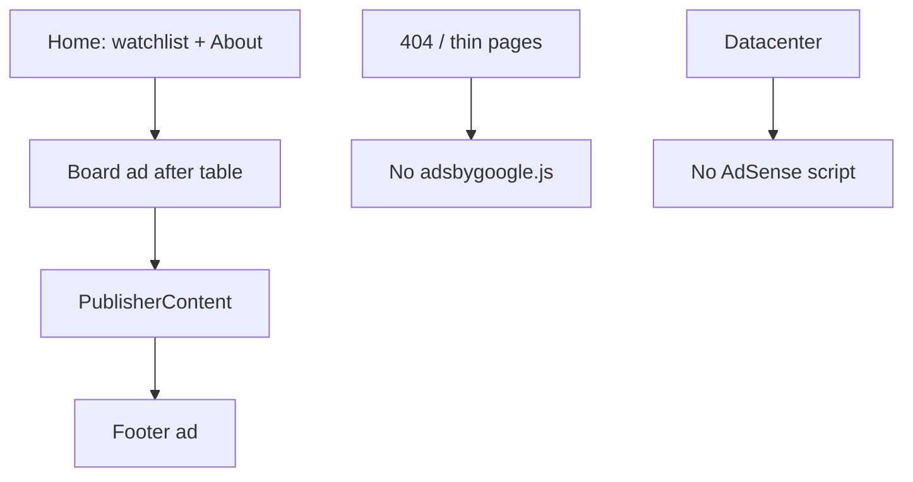

# AdSense — StocksWatch

Publisher ads on the **home watchlist** for passive income. Friends use the research board; AdSense fills inventory **only after** substantial publisher content.

> **AdSense ≠ Google Ads.** Paste a publisher ID + ad unit IDs from the [AdSense console](https://www.google.com/adsense/) — no OAuth into this app.

## Policy compliance (required before requesting review)

Google rejected / flagged sites for **“Google-served ads on screens without publisher-content.”** We adhere as follows:

| Rule | How StocksWatch complies |
|------|--------------------------|
| No ads on empty / low-value / under-construction screens | Units render only when the master watchlist has **≥5 tickers** with theses; otherwise no script and no slots |
| No ads on alert / navigation-only chrome | Ads are **never** in the header, live status bar, or pulse; only labeled “Sponsored” blocks **after** the watchlist |
| No ads above the fold before content | **Hero/top placement is off by default.** Mid-board + footer sit **below** the watchlist table |
| No ads on thin error pages | `404` uses `allowAds={false}`, `noindex`, and **does not** load `adsbygoogle.js` |
| Datacenter is content-heavy but ad-free for now | Separate layout — **no** AdSense script (avoid Auto ads injecting into tool panels) |
| Don’t rely on Auto ads site-wide | **Turn Auto ads OFF** in AdSense → Ads → Auto ads. Use only the manual display units we place |

Also keep quality high: real theses on tickers, the **About this page** editorial block, honest disclaimers, working `ads.txt` / sitemap on your **custom domain**.

### Before you request a review

1. Confirm live home page shows the full watchlist **before** any ad unit.
2. Open a bad URL → 404 has **no** AdSense network requests in DevTools.
3. AdSense console: Auto ads **disabled**; only board + footer units created (hero optional later).
4. Site URL is the custom domain (`stockswatch.cc`), not CloudFront (`seo.requireCustomDomainForAds`).
5. `https://stockswatch.cc/ads.txt` matches your `pub-…`.

### Deploy, then request review

```bash
cd stocks/radar
SCREENER_SKIP=1 npm run rebuild   # or let CI deploy from main
npm run adsense:checklist         # build-side policy gates
```

1. **AdSense → Ads → Auto ads → turn OFF** for `stockswatch.cc` (mandatory).
2. Deploy latest `main` (GitHub Actions → Stocks Radar — deploy, or push when `STOCKS_RADAR_DEPLOY_ENABLED=true`).
3. Live spot-check: `/` has content above Sponsored units; `/nope` 404 has zero `pagead` requests.
4. In AdSense → Sites → request review / fix issues.

Local CI also runs `adsense:checklist` on every validate build.
## How it works here

| Mode | When | What you see |
|------|------|----------------|
| **Preview** | `npm run dev` | Dashed placeholders for **board** + **footer** (after content) |
| **Live** | Prod build, custom domain, CLIENT + board/footer slots, ≥5 tickers | Real units after the board |
| **Off** | `PUBLIC_ADSENSE_ENABLED=false`, empty client, CloudFront-only URL, or tiny watchlist | No slots / no script |

Google almost never fills ads on `localhost`. Preview is for layout QA only.



## One-time: AdSense account + site

1. Create / open [Google AdSense](https://www.google.com/adsense/).
2. Prefer a **custom domain** ([DOMAIN.md](DOMAIN.md)).
3. Add the site; complete verification (`ads.txt` + optional verify meta).
4. Wait for approval. Until then, production stays empty even with IDs set.
5. **Ads → By ad unit → Display ads** — create **2** responsive units (board + footer). Skip a “hero” unit unless you later set `PUBLIC_ADSENSE_ALLOW_HERO=true` (still rendered **after** content).
6. Copy **Publisher ID** (`ca-pub-…`) and each **Ad unit ID**.

### After custom domain is live

1. AdSense → **Sites** → Add `https://yourdomain.com`.
2. Deploy with `STOCKS_RADAR_SITE=https://yourdomain.com`.
3. Confirm `https://yourdomain.com/ads.txt`.
4. Optional: `PUBLIC_ADSENSE_VERIFY_META` for the `google-adsense-account` meta (home only).

## Local setup

```bash
cd stocks/radar
cp .env.example .env
npm run dev
```

Open http://localhost:4321 — **AdSense preview** boxes appear **below** the watchlist, not in the hero.

## Production (GitHub Actions)

| Variable | Example | Notes |
|----------|---------|--------|
| `PUBLIC_ADSENSE_CLIENT` | `ca-pub-…` | Required for live |
| `PUBLIC_ADSENSE_SLOT_BOARD` | `2345678901` | After watchlist |
| `PUBLIC_ADSENSE_SLOT_FOOTER` | `3456789012` | After About / submissions |
| `PUBLIC_ADSENSE_SLOT_HERO` | optional | Unused unless `PUBLIC_ADSENSE_ALLOW_HERO=true` |
| `PUBLIC_ADSENSE_ENABLED` | `true` | Set `false` to kill ads without removing IDs |
| `PUBLIC_ADSENSE_ALLOW_HERO` | unset | Keep unset for policy safety |

## Files

| Path | Role |
|------|------|
| `src/lib/adsense.ts` | Domain / content / placement gates |
| `src/components/AdSlot.astro` | Unit + preview |
| `src/components/PublisherContent.astro` | Editorial “About” copy |
| `src/layouts/BaseLayout.astro` | `allowAds` — script only when opted in |
| `scripts/write-seo-files.mjs` | `ads.txt`, robots, sitemap |
