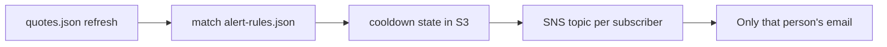

# Personal signal alerts — email when *your* condition hits

Stocks Radar can email **each person only when a rule they care about fires** — not a firehose of every lean-buy on the board.

Stack stays cheap: **GitHub Actions + SNS email + S3 cooldown file**. No Lambda.



## What you can watch for

| `signal` | Fires when |
|----------|------------|
| `lean-buy` / `lean-sell` | Radar score leans buy/sell (`minScore` / `maxScore`) |
| `near-target` | Price within `nearTargetPct` of target |
| `score-at-least` / `score-at-most` | Raw score thresholds |
| `price-below` / `price-above` | Absolute price level (`price`) |
| `rsi-below` / `rsi-above` | RSI(14) vs `rsi` |
| `pct-change-below` / `pct-change-above` | Day % move |
| `near-52w-low` | Within `range52Pct` of 52-week low |
| `near-ath` | Within `pctFromAth` of all-time high |

Scope a rule with **`symbols`** and/or **`tags`** (from `watchlist.json`). Omit both to watch the whole list.

## 1. Add people (emails stay out of git)

In `infra/terraform/terraform.tfvars` (gitignored):

```hcl
alert_subscribers = [
  { id = "jacob",   email = "you@example.com" },
  { id = "friend1", email = "friend@example.com" },
]
```

```bash
cd stocks/radar/infra/terraform
terraform apply
terraform output -json personal_alert_topic_arns
```

Confirm each **Subscription Confirmation** email from AWS SNS.

## 2. Wire GitHub

| Secret | Value |
|--------|--------|
| `STOCKS_RADAR_ALERT_TOPICS` | JSON from `personal_alert_topic_arns`, e.g. `{"jacob":"arn:aws:sns:...","friend1":"arn:..."}` |
| `STOCKS_RADAR_S3_BUCKET` | Same as deploy (stores `_private/alert-state.json` cooldown — not public via CloudFront) |
| AWS keys / region | Same as deploy |

Optional shared broadcast topic: `STOCKS_RADAR_ALERTS_SNS_TOPIC_ARN` (board-wide digests).

Re-enable **Stocks Radar — signal alerts** (and quote refresh) per [DEPLOY.md](DEPLOY.md).

## 3. Write rules (safe to commit — no emails)

Edit [`src/data/alert-rules.json`](src/data/alert-rules.json). `subscriberId` must match a Terraform `alert_subscribers.id`.

```json
{
  "defaults": { "cooldownHours": 24 },
  "rules": [
    {
      "id": "nbis-lean-buy",
      "subscriberId": "jacob",
      "enabled": true,
      "signal": "lean-buy",
      "symbols": ["NBIS"],
      "minScore": 2,
      "note": "Ping me when NBIS leans buy",
      "cooldownHours": 24
    }
  ]
}
```

More examples: [`src/data/alert-rules.example.json`](src/data/alert-rules.example.json).

**Cooldown:** the same rule+symbol will not re-email until `cooldownHours` passes (default 24). Cooldown is recorded **only after a successful SNS publish** (skipped topics / failed publishes do not burn the window). State lives at `s3://$bucket/_private/alert-state.json` (CloudFront cannot read `_private/*`).

**Privacy:** personal hits only publish to `STOCKS_RADAR_ALERT_TOPICS[subscriberId]`. Missing map entries are **skipped** (no shared-topic fallback unless `ALERTS_ALLOW_BROADCAST_FALLBACK=true`).

**Board-wide broadcast:** off by default. Set `ALERTS_BROADCAST=true` **and** `STOCKS_RADAR_ALERTS_SNS_TOPIC_ARN`. Empty `alert-rules.json` alone does **not** broadcast (and does **not** use the daily digest SNS topic).

**Stale quotes:** alerts refuse `fetchFailed` payloads and skip `_carriedForward` quote rows so carried prices cannot fire rules.

## 4. Test locally

```bash
cd stocks/radar
npm run update-quotes
ALERTS_DRY_RUN=true npm run alerts
```

You should see which rules matched and who would be emailed — no SNS publish.

## Friend onboarding

1. Add them to `alert_subscribers` + `terraform apply`
2. They confirm the SNS email
3. They (or you) add rules with their `subscriberId` in `alert-rules.json`
4. Push — next quote refresh / alerts workflow evaluates

## Privacy

- Emails: **only** in `terraform.tfvars` / SNS (not in the repo rules file)
- Site UI shows rule summaries (signal, symbols, tags) without addresses
- Cooldown state has rule keys + timestamps only

## Not in scope (yet)

- Self-serve signup form that writes rules without git (needs a backend)
- SMS / Slack (SNS can do SMS later; Slack needs a webhook or chatbot)
