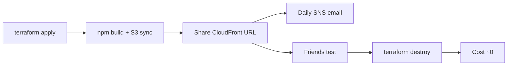

# Friend feedback loop — deploy cheap, share, email digests, destroy

Goal: put Stocks Radar on AWS for friends to try, get feedback (and optional daily email to you), then **tear everything down** so cost goes back to ~$0.



## Cost rules (already in Terraform)

| Do | Don't |
|----|--------|
| `PriceClass_100` only (US/EU edges) | Global CloudFront / WAF / Lambda |
| `enable_custom_domain = false` | Route53 + paid domain while testing |
| Budget alert at **$3/mo** | High budgets or no alerts |
| Destroy when feedback is done | Leave the distribution running unused |

Expected while live with light friend traffic: **about $0.50–3/mo**.  
After `terraform destroy`: **about $0** (beyond any leftover pennies on the bill cycle).

## 1. Apply (one-time for this trial)

```bash
cd stocks/radar/infra/terraform
cp terraform.tfvars.example terraform.tfvars
# Set: allowed_account_ids, site_bucket_name
# Digests + budget alerts default to jacob.idolor@outlook.com in terraform.tfvars.example
terraform init
terraform plan
terraform apply
```

Confirm SNS email: AWS will send **Subscription Confirmation** — click the link or digests never arrive.

Save outputs:

```bash
terraform output cloudfront_url
terraform output s3_bucket_name
terraform output cloudfront_distribution_id
terraform output daily_digest_topic_arn
```

## 2. Deploy the site

**Option A — GitHub Actions (good if secrets already set)**  
Add secrets from [DEPLOY.md](DEPLOY.md), plus:

| Secret | Value |
|--------|--------|
| `STOCKS_RADAR_DIGEST_SNS_TOPIC_ARN` | `terraform output -raw daily_digest_topic_arn` |

Then push `stocks/radar/**` to `main` or run **Stocks Radar — deploy**.

**Option B — laptop**

```bash
cd stocks/radar/infra
./deploy.sh
# Windows: bash ./deploy.sh   (Git Bash) or follow DEPLOY.md manual aws s3 sync
```

Share the CloudFront URL with friends. No custom domain required.

## 3. Daily email (viewers + watchlist mood)

- **Workflow:** `.github/workflows/stocks-radar-daily-digest.yml` (13:00 UTC daily + manual run)
- **Contents:** CloudFront requests + bytes (last ~24h), watchlist mood from live `quotes.json`
- **Cost:** GitHub Actions minutes + SNS email (~free at this scale). **No Lambda.**

Local dry run:

```bash
cd stocks/radar
set DIGEST_DRY_RUN=true
set STOCKS_RADAR_CLOUDFRONT_DISTRIBUTION_ID=E...
set STOCKS_RADAR_SITE=https://d....cloudfront.net
set AWS_PROFILE=pet-projects
npm run digest
```

## 4. Destroy when feedback is done

`prevent_destroy` is **off** so teardown is straightforward:

```bash
cd stocks/radar/infra/terraform
# Empty bucket objects so destroy does not stick:
aws s3 rm "s3://$(terraform output -raw s3_bucket_name)" --recursive --profile pet-projects
terraform destroy
```

Or:

```bash
./destroy.sh
```

After destroy: remove or leave GitHub secrets (safe either way). Digests stop once the distribution ID/topic are gone.

## Checklist

- [ ] `terraform apply` with budget email + digest email  
- [ ] Confirm SNS subscription email  
- [ ] First site deploy + share URL with friends  
- [ ] Optional: run **Stocks Radar — daily digest** manually once  
- [ ] Collect feedback  
- [ ] `terraform destroy` (stop the meter)  
