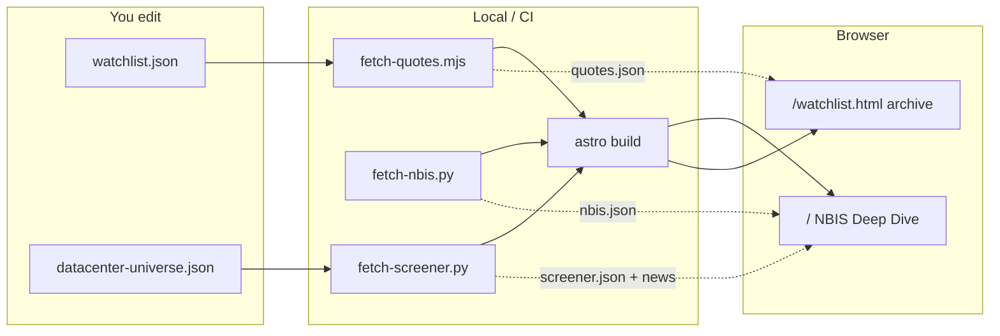
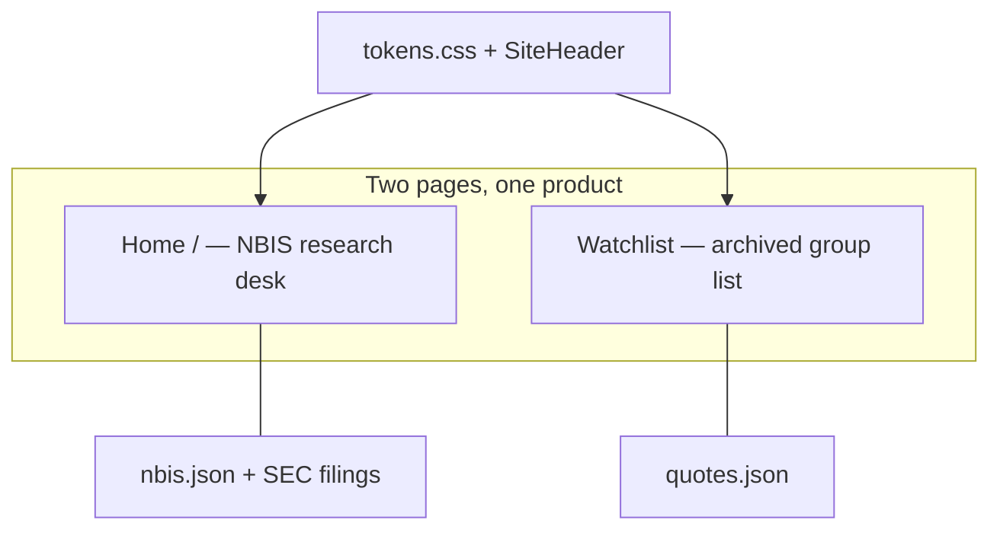

# StocksWatch

NBIS research desk + archived group watchlist. Static Astro — no browser API keys. The production target is Cloudflare Pages, provisioned with Terraform and refreshed once daily by GitHub Actions.

> Not financial advice.

**Domain:** [stockswatch.cc](https://stockswatch.cc) (attach the origin with Terraform) · **Surfaces:** `/` (NBIS Deep Dive) · `/watchlist.html` (archived group watchlist) · `/datacenter.html` (legacy redirect)

Code map: [ARCHITECTURE.md](ARCHITECTURE.md)

Local Flask + full backtest: [archive/ai-datacenter-screener/](archive/ai-datacenter-screener/)

---

## How it works



**Local refresh:** `npm run update-quotes` / `npm run update-screener` writes JSON under `public/`.



---

## Quick start

```bash
cd stocks/radar
npm ci
npm run dev
```

Useful checks (also run in CI validate):

```bash
npm test                 # unit tests (ads gates, freshness math, sanitize, radar-score)
npm run screener:schema  # offline screener.json shape/coverage
npm run nbis:schema      # offline NBIS snapshot shape/coverage
npm run typecheck        # tsc --noEmit
npm run freshness        # local quotes/screener age
npm run adsense:checklist  # after build — AdSense policy gates in dist/
SCREENER_SKIP=1 npm run build && npm run test:e2e   # Playwright smoke
```

| Page | URL |
|------|-----|
| NBIS Deep Dive | http://localhost:4321/ |
| Archived watchlist | http://localhost:4321/watchlist.html |
| Legacy data-center redirect | http://localhost:4321/datacenter.html |

NBIS snapshot (needs Python once):

```bash
pip install -r scripts/datacenter/requirements.txt
npm run update-nbis        # → public/nbis.json
npm run nbis:schema        # local shape/coverage assert
```

---

## What you edit

| File | Purpose |
|------|---------|
| `src/data/watchlist.json` | Group list |
| `src/data/nbis-profile.json` | NBIS company map, monitoring checklist, primary sources |
| `src/data/datacenter-universe.json` | Archived AI DC layers + holdings |
| `src/data/site-settings.json` | Features, quote staleness |
| `src/styles/tokens.css` | Shared design tokens (`npm run sync:tokens` → `public/tokens.css` on prebuild) |

CSV → watchlist: `npm run import-csv -- my-tickers.csv`

### NBIS product limits (static hosting)

| Feature | Behavior |
|---------|----------|
| Prices | Daily CI snapshot — not a live quote stream |
| Filings | SEC EDGAR links and structured facts where available |
| Scenarios | Transparent assumptions, never price targets |
| News | Discovery feed; verify material claims against filings |
| Monetization | Free research first; email brief/sponsor/premium archive later |

---

## Ship

Cloudflare Pages is the intended production host. Provision the project and DNS first:

```powershell
cd radar/infra/terraform
$env:CLOUDFLARE_API_TOKEN = "..."
terraform init
terraform apply
```

Then add the GitHub Actions secrets described in [infra/terraform/README.md](infra/terraform/README.md) and run the daily workflow once manually. Local parity: `npm run rebuild`.

---

## Layout

```
stocks/radar/
  src/pages/index.astro          # NBIS research desk
  src/pages/datacenter.astro     # legacy redirect
  src/client/nbis-dashboard.ts   # NBIS browser hydration
  src/client/board/              # watchlist UI modules
  src/styles/home/               # CSS partials (via global.css)
  src/data/watchlist.json
  src/data/datacenter-universe.json
  public/quotes.json
  public/screener.json
  public/datacenter/             # UI + static-api.js
  scripts/fetch/                 # quotes, outlook, screener
  scripts/ops/                   # health, SEO, validate, bundle
  scripts/alerts/                # digest + signal alerts
  scripts/lib/                   # shared helpers (action-bias, sanitize)
```

See [ARCHITECTURE.md](ARCHITECTURE.md) for the full map.
---

## Docs

| Doc | Topic |
|-----|--------|
| [ARCHITECTURE.md](ARCHITECTURE.md) | Code map + data flow |
| [PRODUCTION.md](PRODUCTION.md) | Live ops + hardening |
| [SCORE.md](SCORE.md) | Radar lean buy / sell |
| [DEPLOY.md](DEPLOY.md) | Hosting status (none yet) |
| [DOMAIN.md](DOMAIN.md) | stockswatch.cc / Cloudflare |
| [ADSENSE.md](ADSENSE.md) | Ads |
| [SECURITY.md](SECURITY.md) | Hardening |
| [ALERTS.md](ALERTS.md) | Signal emails |
| [PRODUCT.md](PRODUCT.md) | NBIS product and monetization path |
| [infra/terraform/README.md](infra/terraform/README.md) | Cloudflare Pages deployment |

## License

[MIT](../../LICENSE)
