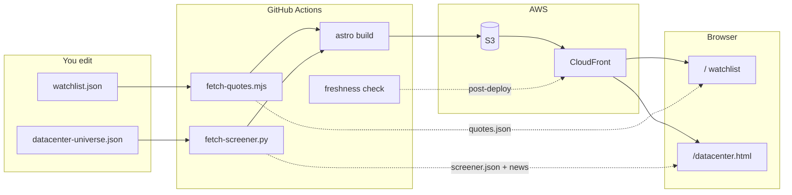
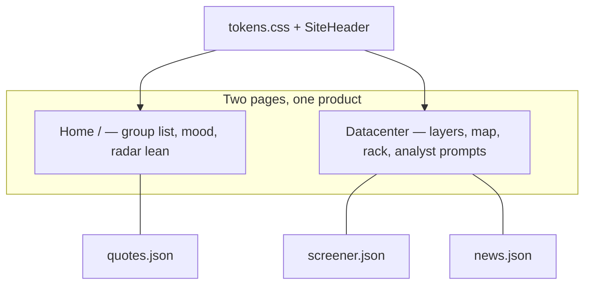

# StocksWatch

Group watchlist + AI data-center screener. Static Astro on **S3 + CloudFront** — no app server, no Yahoo API keys.

> Not financial advice.

**Live:** [stockswatch.cc](https://stockswatch.cc) · **Surfaces:** `/` (watchlist) · `/datacenter.html` (six-layer screener)

---

## How it works



**Weekday refresh** (no full rebuild) updates `quotes.json` + `screener.json` + `news.json` on S3, then re-checks freshness.



---

## Quick start

```bash
cd stocks/radar
npm install
npm run dev
```

Useful checks (also run in CI validate):

```bash
npm test                 # unit tests (ads gates, freshness math, sanitize, radar-score)
npm run screener:schema  # offline screener.json shape/coverage
npm run typecheck        # tsc --noEmit
npm run freshness        # local quotes/screener age
npm run adsense:checklist  # after build — AdSense policy gates in dist/
SCREENER_SKIP=1 npm run build && npm run test:e2e   # Playwright smoke
```

| Page | URL |
|------|-----|
| Watchlist | http://localhost:4321 |
| AI Data Center | http://localhost:4321/datacenter.html |

Screener snapshot (needs Python once):

```bash
pip install -r scripts/datacenter/requirements.txt
npm run update-screener    # → public/screener.json + news.json
npm run freshness         # local age/coverage assert
```

---

## What you edit

| File | Purpose |
|------|---------|
| `src/data/watchlist.json` | Group list |
| `src/data/datacenter-universe.json` | AI DC layers + holdings |
| `src/data/site-settings.json` | Features, quote staleness |
| `src/styles/tokens.css` | Shared design tokens (`npm run sync:tokens` → `public/tokens.css` on prebuild) |

CSV → watchlist: `npm run import-csv -- my-tickers.csv`

### Datacenter limits (static hosting)

| Feature | Behavior |
|---------|----------|
| Prices | CI / refresh snapshot — not live Yahoo from the browser |
| Refresh button | Reloads `screener.json` from the CDN |
| News | From `news.json` built with the screener |
| AI Analyst | Copy-paste prompt only |
| Lookup / trends | Browser `localStorage` |

---

## Ship

```bash
# Local parity
npm run rebuild

# Or push to main (deploy gated by STOCKS_RADAR_DEPLOY_ENABLED)
# Manual:
pip install -r scripts/datacenter/requirements.txt
npm ci && npm run build
./infra/deploy.sh
```

Infra ~$0.50–3/mo — [DEPLOY.md](DEPLOY.md) · [GO_LIVE.md](GO_LIVE.md) · [PRODUCTION.md](PRODUCTION.md)

---

## Layout

```
stocks/radar/
  src/pages/index.astro          # watchlist
  src/pages/datacenter.astro     # screener
  src/components/SiteHeader.astro
  src/styles/tokens.css
  src/data/watchlist.json
  src/data/datacenter-universe.json
  public/quotes.json
  public/screener.json
  public/datacenter/             # UI + static-api.js
  scripts/fetch-quotes.mjs
  scripts/fetch-screener.py
  scripts/check-live-freshness.mjs
  infra/                         # Terraform + deploy
```

---

## Docs

| Doc | Topic |
|-----|--------|
| [PRODUCTION.md](PRODUCTION.md) | Live ops + hardening |
| [SCORE.md](SCORE.md) | Radar lean buy / sell |
| [DEPLOY.md](DEPLOY.md) | AWS + Actions |
| [DOMAIN.md](DOMAIN.md) | Custom domain |
| [ADSENSE.md](ADSENSE.md) | Ads |
| [GO_LIVE.md](GO_LIVE.md) | First-time checklist |
| [SECURITY.md](SECURITY.md) | Hardening |
| [ALERTS.md](ALERTS.md) | Signal emails |

## License

[MIT](../../LICENSE)
